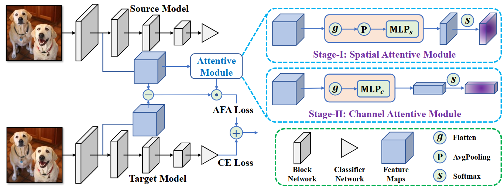

## Towards Effective Deep Transfer via Attentive Feature Alignment

We provide PyTorch implementation for "Towards Effective Deep Transfer via Attentive Feature Alignment".

## Dependencies

* Python 3.6
* Pytorch 1.1.0
* Dependencies in requirements.txt

### Installation

1. Clone this repo:

        git clone https://github.com/xiezheng-cs/AFA.git
        cd DTQ

2. Install pytorch and other dependencies.

        pip install -r requirements.txt

### Training

1. **First Stage**:
   
        ResNet101: python main.py hocon_config/First_stage_AST/resnet101_stanford_dogs_120.hocon

        MobileNet_V2: python main.py hocon_config/First_stage_AST/mobilenet_v2_stanford_dogs_120.hocon

2. **Second Stage**:

        ResNet101: python main.py hocon_config/Second_stage_ACT/resnet101_Stanford_dogs_120.hocon

        MobileNet_V2: python main.py hocon_config/Second_stage_ACT/mobilenet_v2_Stanford_dogs_120.hocon

## Results

  |  Target Data Set | Model | DELTA Top1 Acc(%) | AFA(Ours) Top1 Acc(%) |
   | :-: | :-: | :-: | :-: |
  | Stanford Dogs 120 | MobileNetV2 | 81.3±0.1 | **82.1±0.1** |
  | Stanford Dogs 120 |  ResNet-101  | 88.7±0.1 | **90.1±0.0** |

 

## Pre-trained Model

 | Model | Link| Top1 Acc (%)|
   | :-: | :-: | :-: |
 |ResNet101|https://github.com/xiezheng-cs/AFA/releases/tag/models| 90.22|
 |MobileNetV2|https://github.com/xiezheng-cs/AFA/releases/tag/models| 82.17|

## Eval
        
        ResNet101: python main.py hocon_config/val/resnet101_Stanford_dogs_120.hocon

        MobileNet_V2: python main.py hocon_config/val/mobilenet_v2_Stanford_dogs_120.hocon

## Citation
If this work is useful for your research, please cite our paper:

    @InProceedings{xie2021afa,
    title = {Towards Effective Deep Transfer via Attentive Feature Alignment},
    author = {Zheng Xie, Zhiquan Wen, Yaowei Wang, Qingyao Wu, and Mingkui Tan},
    journal = {Neural Networks},
    volume = {138},
    pages = {98-109},
    year = {2021}
    }
